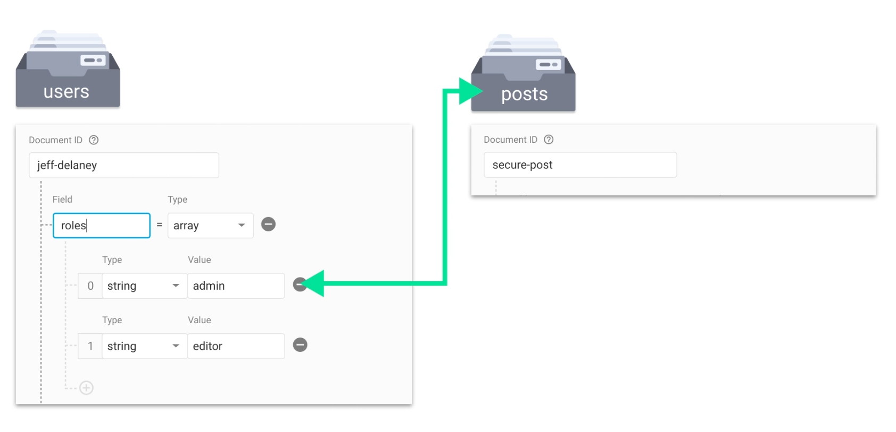

2 Ways to model access control in firebase: role based and access control lists.

Role based authorization alternative: custom claims.


User document defines access. Similar to netflix subscription.
Wouldnt work in context like Google Play, role-base wouldnt work there.


Firestore rules make this work:

```js
// rules.json
match /posts/{document} {

    function getRoles() {
        return get(/databases/$(database)/documents/users/$(request.auth.uid)).data.roles;
    }

    allow read;
    allow update: if getRoles().hasAny(['admin', 'editor']) == true;
    allow write: if getRoles().hasAny(['admin']) == true;
}

```

Advantage: No Backend Code required here.
Drawback: Firestore read required for every update/write.


